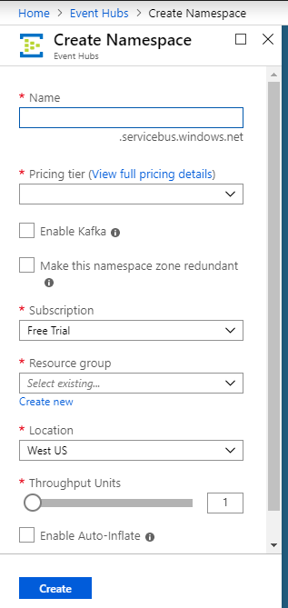
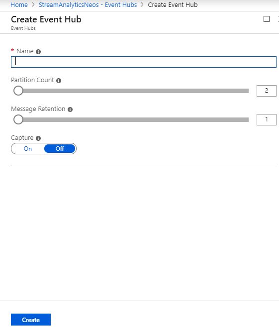
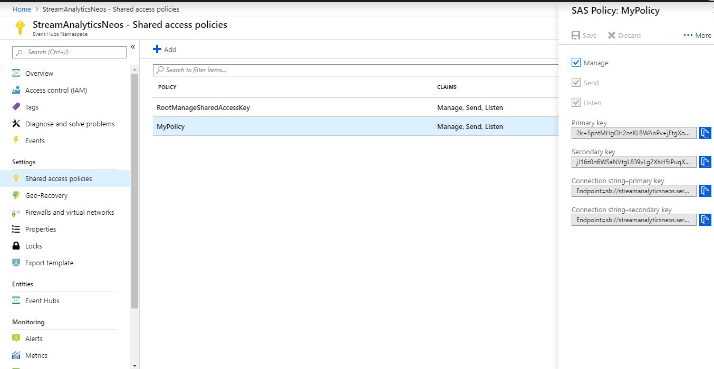

# Create Event Hub resource on Azure and configure its policy

# 1. Create Eventhub Namespace

Enter Eventhub Namespace name, Resource Group,Subscription Details and Price tier and click on Create button.  

# 2. Create Eventhub

Enter Eventhub Name and Partition count to 2 and click on Create button.  

# 3. Define Shared Access Policies	

Goto Setting on Event Hub Namespace and click on Shared Access policy. Click o New Policy and Select Manage Option. Copy Primary Key connection string for further use. 