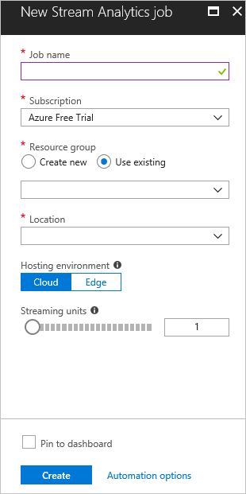
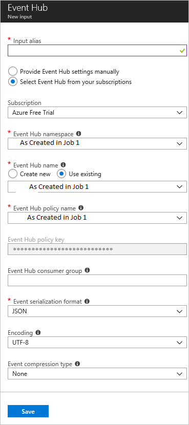

# Set up Azure Stream Analytics

# 1. Create stream Analytics Job

1. In the Azure portal, click Create a resource. Type stream analytics into the search box and press Enter. Select Stream Analytics Job. Click Create on the Stream Analytics job pane.

2. Enter the following information for the job:

Job name: This field is the name of the job and it must be globally unique.

Subscription: Select your subscription.

Resource group: Use the same resource group used by your event hub.

Location: Use the same location used in the setup script.

# 2. Add an input to the Stream Analytics job

1. Under Job Topology, click Inputs.

2. In the Inputs pane, click Add stream input and select Event Hubs. On the screen that appears, fill in the following fields:

Input alias: This field is the name of the input stream, used when defining the query for the data.

Subscription: Select your subscription.

Event Hubs namespace: Select your Event Hub namespace (As created in Job 1).

Event Hub name: Click Use existing and select your event hub (As created in Job 1).

Event Hubs policy name: (As created in Job 1).

Event Hubs consumer group: Leave this field blank to use the default consumer group.  

# 3. Define Shared Access Policies	

Goto Setting on Event Hub Namespace and click on Shared Access policy. Click o New Policy and Select Manage Option. Copy Primary Key connection string for further use. 