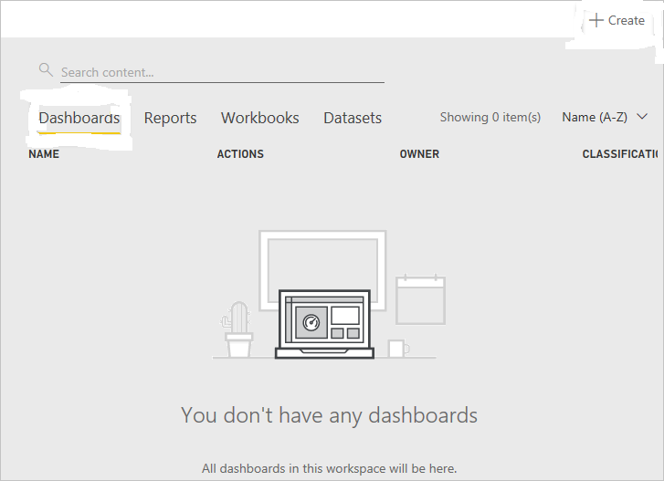
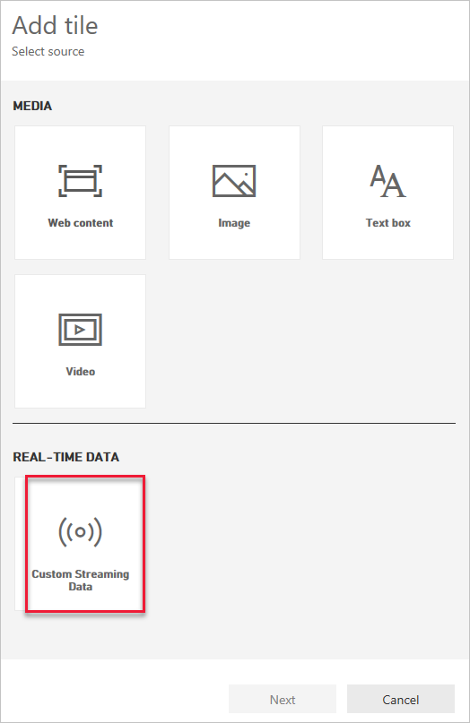
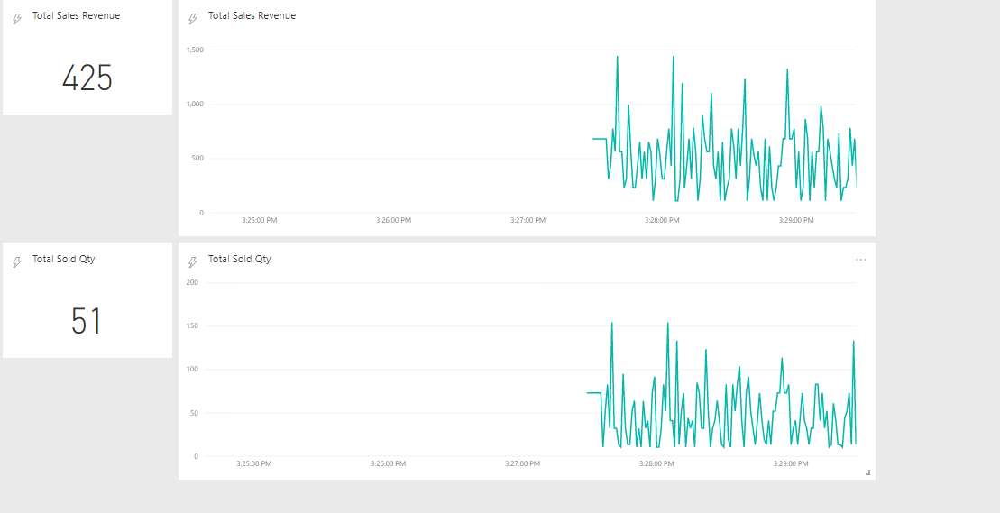

# Set up the Power BI for Visualize Live Data Streaming

# 1. Setup Poer BI Account and Configure Workspace 
Sign in to your Power BI account.

Go to My Workspace.

Click Datasets.

You should see the dataset that you specified when you created the output for the Stream Analytics job (As created in Job 3).

# 2. Create Dashboards 
1. Click Dashboards, then click Create and select Dashboard.

2. Specify the name of the dashboard, then click Create. sales Dashboard.

3. On the Dashboard page, click Add tile, select Custom Streaming Data in the REAL - TIME DATA section, then click Next.

4. Select your dataset (As created in Job 3 (Stream Analytics Job Output Section)) and click Next.

5. Select Card / Line Chart for visualization type. Under Fields, click Add value, then select filed like SoldQty/ ShippingCost etc.

