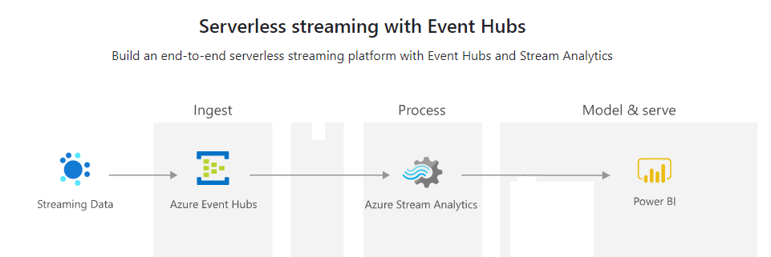

# Serverless streaming with Event Hubs
**Produced by NeosAlpha Technologies**

# Introduction
In this demo we are analysing streaming data using Azure Event Hubs.Azure Stream Analytics service makes it easy to ingest, process.

# Soltion Architecture Design

# Set up
We are dividing this task in following Labs

Lab 1: Create Event Hub resource on Azure and configure its policy

Lab 2: Push sales data of Evenrt sales to event hub for Stream Analysis

Lab 3: Create Stream Analytics Job and Configure Input and output

Lab 4: show Sales data on PowerBi using Stream Data Analytics
